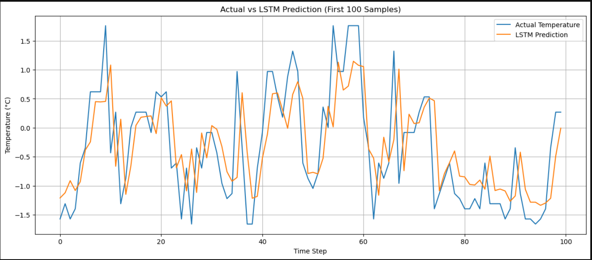
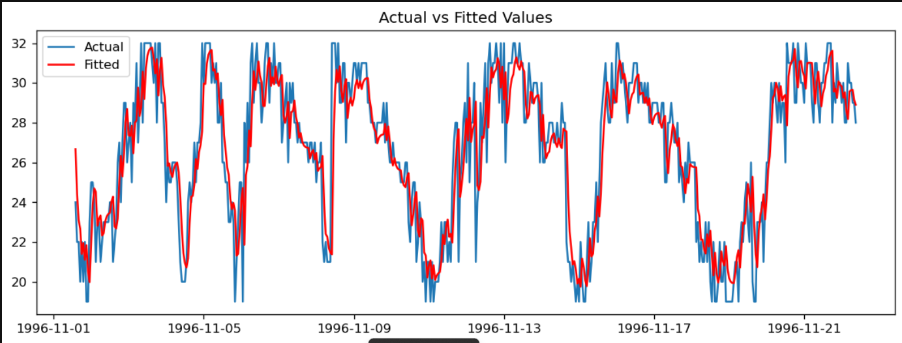
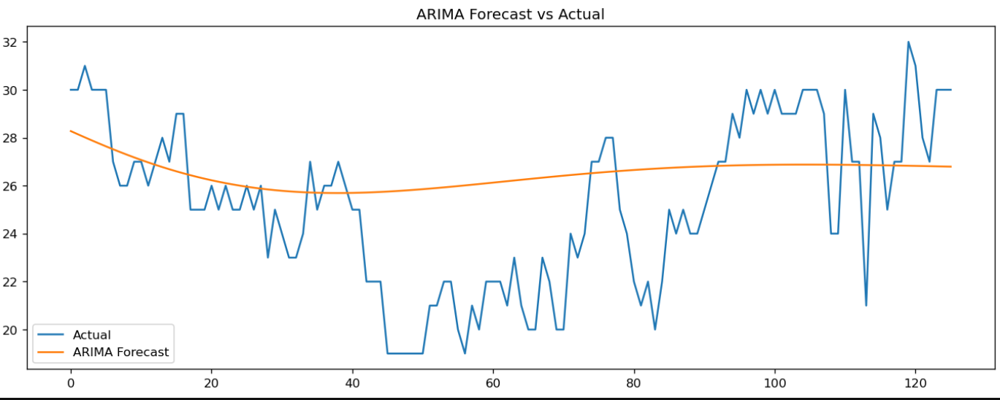

# 🌦️ Weather Temperature Forecasting using ARIMA and LSTM

## 📌 Overview
This project focuses on predicting temperature using time-series forecasting and comparing a statistical model (ARIMA) with a deep learning model (LSTM).

---

## 🎯 Objective
To evaluate whether deep learning models outperform traditional statistical methods for time-series forecasting.

---

## ⚙️ Models Used
- **ARIMA** (AutoRegressive Integrated Moving Average)
- **LSTM** (Long Short-Term Memory Neural Network)

---

## 📈 Results

- **LSTM RMSE:** 2.65°C  
- **ARIMA RMSE:** 3.33°C  
- **Improvement:** ~20% better accuracy using LSTM  

---

## 📊 Visualizations

### 🔹 LSTM Predictions vs Actual

### 🔹 ARIMA Fitted Values vs Actual

### 🔹 ARIMA Forecast vs Actual

---

## 🧠 Key Insights
- LSTM captures **non-linear temporal patterns** better than ARIMA  
- ARIMA struggles with complex fluctuations  
- Deep learning provides **more accurate forecasting** for time-series data  

---

## 🛠️ Tech Stack
- Python  
- Statsmodels (ARIMA)  
- TensorFlow / Keras (LSTM)  
- Pandas, NumPy  
- Matplotlib  

---

## 🚀 Future Work
- Add more features (humidity, wind speed)  
- Try GRU and Transformer models  
- Deploy as a web application  

---
